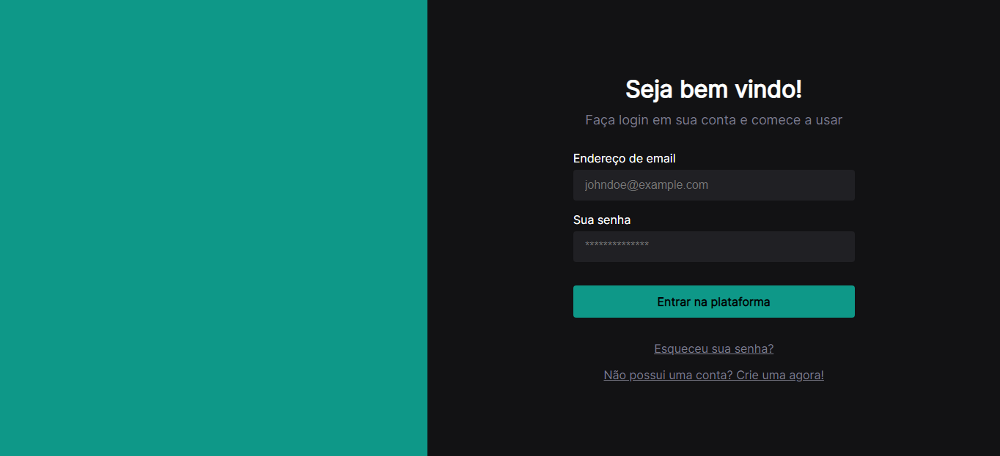
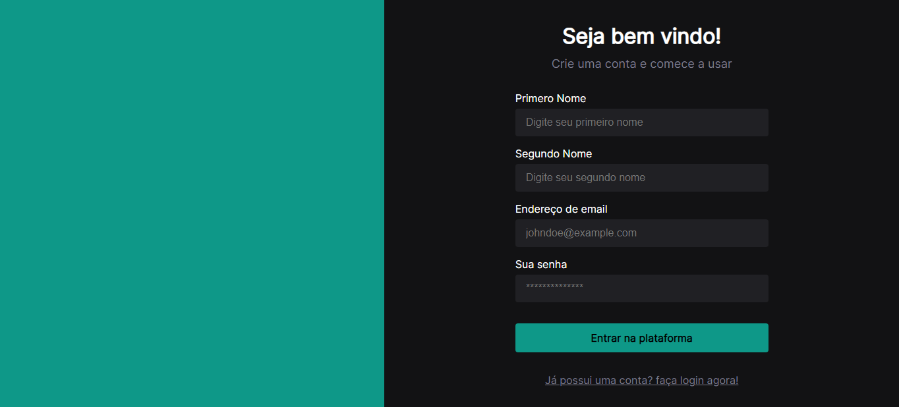
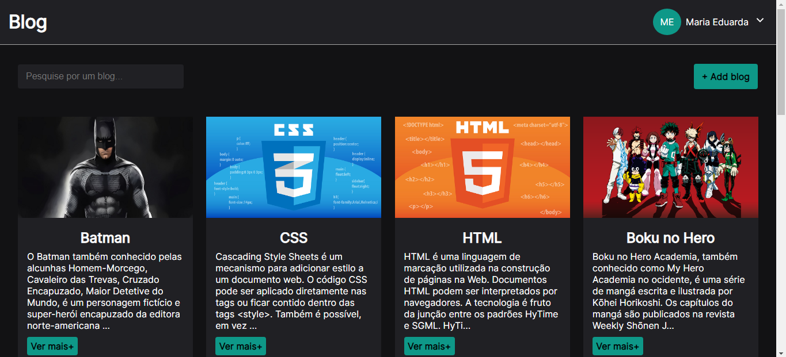
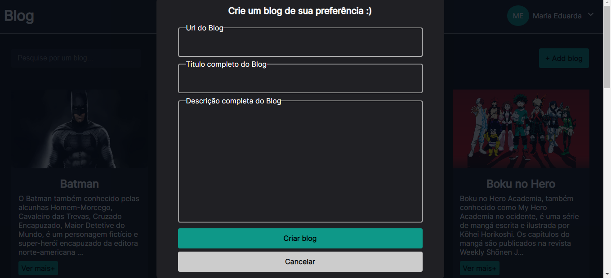
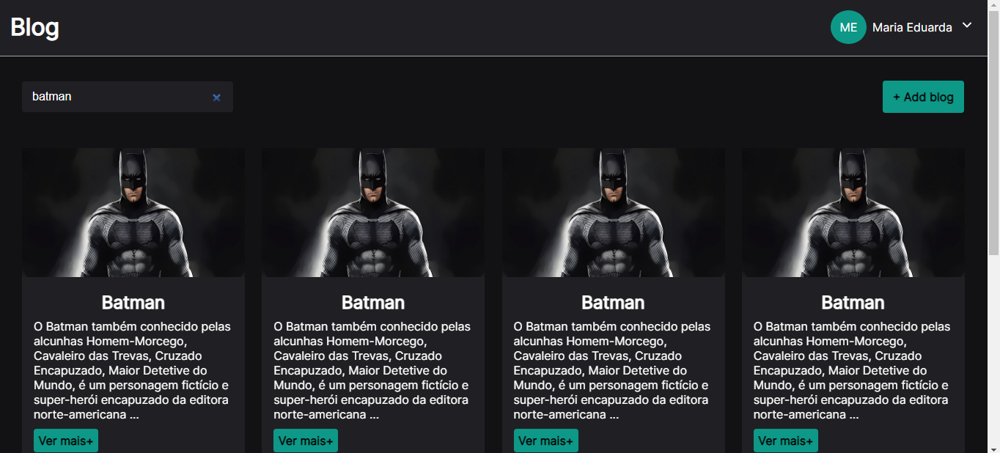

<h1 align="center">
  next-auth
</h1>

<p align="center">
 

  
</p>

## 🚀 Tecnologias

- ReactJS
- NextJS
- AuthContext
- Sass
- Typescript
- Axios
- useForm
- React-Toastify
- NodeJS
- AdonisJS
- Lucid
- Sqlite
- Middleware

</br>

### Como rodar o projeto

### 🎲 Rodando o Back-End (servidor)

```bash
# Acesse a pasta do projeto no terminal/cmd
$ cd next-auth

# Vá para a pasta backend
$ cd backend

# Instale as dependências
$ yarn || npm i

# Execute a aplicação em modo de desenvolvimento
$ yarn dev || npm run dev

```

### 🎲 Rodando o Front-End

```bash

# Vá para a pasta web
$ cd web

# Instale as dependências
$ yarn || npm i

# Execute a aplicação em modo de desenvolvimento
$ yarn dev || npm run dev

```

</br>

## 💻 Sobre o projeto

<p>
    A ideia do projeto é para estudar como funciona a autenticação no Nextjs, E estudo de Design System 
</p>

</br>

</br>

# Funcionalidade
    - Cadastro e Autenticação de Usuário via Token
    - Listagem
    - Criação de Blogs
    - Rotas Privadas
    - Rotas Protegidas
    - validação de formulário
    - Uploads de imagens

<h3> 
	Design do projeto
</h3>

- [Design System](https://www.figma.com/file/U9TAFDRVFzd8eB8emJNzzH/Untitled/duplicate)

<br/>

<h1 align="center"> 
	Projeto
</h1>

<h1 align="center">
  
</h1>

<h1 align="center">
  
</h1>

<h1 align="center">
  
</h1>

<h1 align="center">
  
</h1>

<h1 align="center">
  
</h1>
